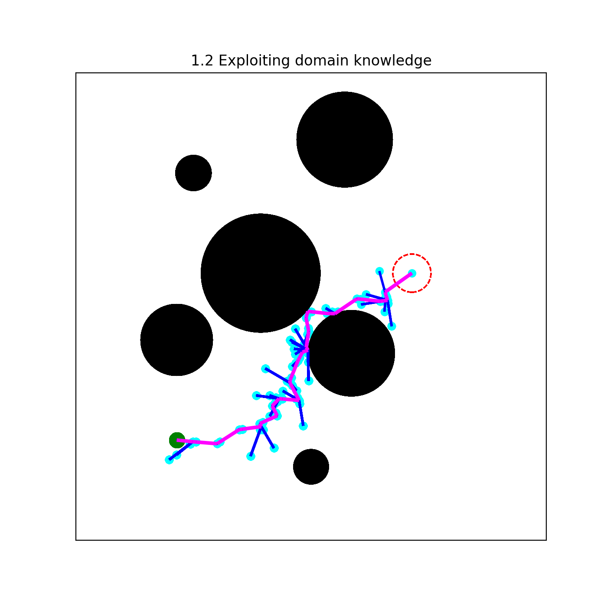

# Final Project - AI614 (Spring 2022)
Truly understanding sampling-based motion planning

 

## Part 0. Environment creation

 

## Part 1. Exploration and exploitation

* 1.1 An alternative sampling-based algorithm

  * Q1) Is this algorithm probabilistically complete? Why or why not?

  * Q2) Comment on the tree-growth procedure. Does it efficiently explore the configuration space? Why or why not?

* 1.2 Exploiting domain knowledge
  * Q1) Is this more efficient than the previous algorithm? Why or why not?

  * Q2) How would you improve this algorithm?
  
* 1.3 RRT
  * Q1) Is RRT more efficient than the ones given in 1.1 and 1.2? If so, describe what makes RRT more efficient.

  * Q2) In what cases will the algorithm in 1.2 be more efficient than RRT?

 

## Part 2. Limitations of RRT*

* 2.1 RRT*

  * Q1) Implement RRT*. Is it faster than RRT? What is the most time consuming procedure?

* 2.2 (Potentially) Improving RRT*
  * Q1) Is this RRT* variant faster than standard RRT*? Why or why not?
  
  * Q2) How would you improve this variant?
